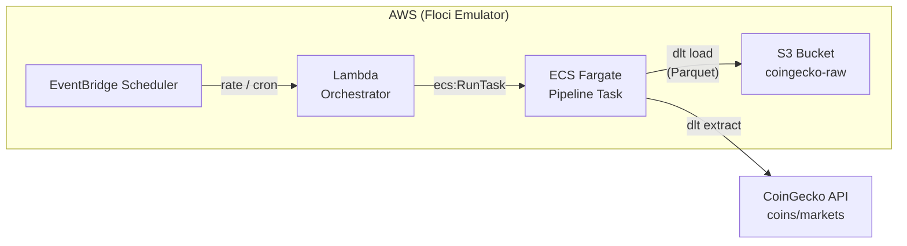

# CoinGecko Data Pipeline

[](https://www.python.org/)
[](https://dlthub.com/)
[](https://aws.amazon.com/)
[](https://www.terraform.io/)
[](https://www.docker.com/)
[](https://github.com/anomalyco/floci)
[](LICENSE)

> Serverless AWS data pipeline that extracts cryptocurrency market data from the CoinGecko API, processes it with **dlt**, and stores it as **Parquet** in **S3** — fully simulated locally via **Floci**.
>
> This is my first AWS project — built to learn serverless architecture hands-on without an AWS account. The plan is to deploy it on real AWS next and compare the experience.

---

## Background & Motivation

I built this project to learn AWS serverless architecture from scratch — I had no prior professional experience with Lambda, ECS Fargate, S3, or Terraform. The goal was to design and run a real-world data pipeline end-to-end without needing an AWS account or incurring cloud costs.

**Why Floci?** [Floci](https://github.com/floci-io/floci) is an AWS emulator (a fork of LocalStack) that runs Lambda, ECS, S3, ECR, CloudWatch, and EventBridge locally. This means:

- **Zero AWS costs** — iterate freely, run as many times as needed
- **Fast dev loop** — build, deploy, and test entirely on your machine
- **Reproducible environment** — no account setup, no IAM policy guesswork
- **Learning by doing** — the Terraform and AWS API calls are identical to real AWS, so everything learned transfers directly

The pipeline works 100% locally today. The next step is deploying it on real AWS to uncover the differences in configuration, API compatibility, debugging, and overall developer experience — and document them here.

---

## Architecture



---

## Features

- **Top 250 coins** — extracts market data (price, volume, market cap) in USD from the public CoinGecko API
- **Declarative pipelines** — uses [dlt](https://dlthub.com/) for schema inference, incremental loading, retry, and rate limiting
- **Parquet on S3** — columnar output with S3 versioning enabled
- **Serverless orchestration** — Lambda invokes ECS Fargate tasks on demand
- **Scheduled or on-demand** — optional EventBridge Scheduler (rate/cron expression)
- **Infrastructure as Code** — full AWS topology defined in Terraform
- **100% local simulation** — [Floci](https://github.com/anomalyco/floci) emulates Lambda, ECS, S3, CloudWatch, and ECR without AWS costs

---

## Quick Start

### Prerequisites

- [Docker](https://docs.docker.com/get-docker/) + [Docker Compose](https://docs.docker.com/compose/install/)
- [make](https://www.gnu.org/software/make/) — GNU Make (install according to your OS/distribution)
- [uv](https://docs.astral.sh/uv/) (Python package manager)
- [Terraform](https://developer.hashicorp.com/terraform/install) >= 1.0
- [AWS CLI](https://aws.amazon.com/cli/) (for local Floci interactions)

### Setup

```bash
# 1. Configure project variables
cp infra/terraform.tfvars.example infra/terraform.tfvars
cp .dlt/secrets.toml.example .dlt/secrets.toml

# 2. Start Floci and provision infrastructure
make bootstrap

# 3. Build Docker images (pipeline + orchestrator)
make build-pipeline
make build-orchestrator

# 4. Push images to local ECR
make push-all

# 5. Invoke the pipeline
make invoke
```

Check results:

```bash
make status    # list ECS tasks + S3 objects
make logs      # tail Lambda and ECS log streams
```

---

## Usage

### Makefile Commands

| Command | Description |
|---|---|
| `make bootstrap` | Wait for Floci → `terraform init && apply` |
| `make build-pipeline` | Build pipeline Docker image (dlt + CoinGecko) |
| `make build-orchestrator` | Build Lambda orchestrator Docker image |
| `make push-all` | Tag and push both images to local ECR |
| `make invoke` | Invoke Lambda to trigger an ECS pipeline run |
| `make status` | Show ECS tasks + S3 objects |
| `make logs` | Show Lambda and ECS log streams |
| `make enable-schedule EXPR="rate(1 hour)"` | Enable EventBridge scheduling |
| `make disable-schedule` | Disable scheduling |
| `make destroy` | `terraform destroy` + `docker compose down` |

### Pipeline Orchestration

The Lambda handler checks for running ECS tasks before starting a new one, preventing duplicate runs. If a task is already active, the invocation is skipped.

---

## Project Structure

```
.
├── docker/
│   ├── Dockerfile.pipeline       # Pipeline image (dlt + Python)
│   └── Dockerfile.orchestrator   # Lambda image (boto3 + powertools)
├── infra/                        # Terraform: ECR, ECS, Lambda, S3, IAM, EventBridge
│   ├── main.tf
│   ├── ecs.tf / lambda.tf / s3.tf / iam.tf / scheduler.tf
│   └── terraform.tfvars.example
├── src/
│   ├── pipeline/
│   │   ├── pipeline.py           # dlt source (CoinGecko API → Parquet)
│   │   └── main.py               # Entrypoint
│   └── orchestrator/
│       └── handler.py            # Lambda handler (ECS RunTask)
├── .dlt/
│   ├── config.toml               # dlt runtime config (rate limit, retries)
│   └── secrets.toml.example      # S3 bucket URL + AWS credentials
├── Makefile                      # Build / deploy / invoke orchestration
├── docker-compose.yml            # Floci emulator service
└── pyproject.toml                # Python dependencies (uv)
```

---

## Configuration

### Terraform

| File | Purpose |
|---|---|
| `infra/terraform.tfvars` | Project name, Floci endpoint, CoinGecko API key |
| `infra/terraform.tfvars.example` | Template (safe to commit) |

### dlt

| File | Purpose |
|---|---|
| `.dlt/config.toml` | Rate limiting (10 req/s), backoff factor, max retries |
| `.dlt/secrets.toml` | S3 destination URL and AWS credentials (gitignored) |
| `.dlt/secrets.toml.example` | Template (safe to commit) |

### Environment

| File | Purpose |
|---|---|
| `.env.docker` | Docker Compose variables for Floci |

---

## Roadmap

- [ ] **Deploy on real AWS** — adapt Terraform provider, push images to real ECR, validate end-to-end
- [ ] **Compare Floci vs real AWS** — document experience differences:
  - Configuration changes needed (provider, credentials, ECR endpoints, networking)
  - API compatibility gaps (what Floci ignores or simulates differently)
  - Debugging and observability (local state vs CloudWatch)
  - Deploy loop speed and iteration impact
  - Emulator limitations uncovered in real AWS
- [ ] **Add tests** — unit tests for the pipeline and orchestrator
- [ ] **CI/CD** — automate build, push, and deploy

---

## License

[MIT](LICENSE)
